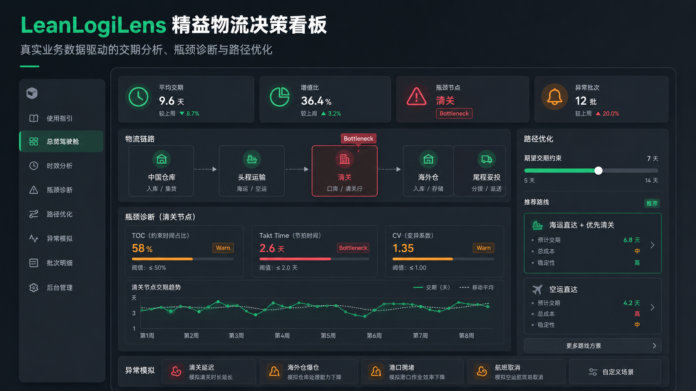

# LeanLogiLens 精益物流决策看板



> 真实业务数据驱动的交期分析、瓶颈诊断与路径优化系统。  
> 面向跨境物流、海外仓、供应链运营团队，用一套可落地的数字化看板把“交期为什么变长、瓶颈在哪里、路线该怎么选”讲清楚。

[线上预览](https://logistics.void52.site/) · [API 健康检查](https://logistics.void52.site/api/health) · [接口文档](https://logistics.void52.site/docs)

## 项目定位

LeanLogiLens 不是静态 BI 大屏，而是一个用于物流运营试运行的决策沙盘：

- **时效分析**：按业务批次拆解国内仓、头程、清关、海外仓、尾程等节点，计算全链路交期与增值比。
- **瓶颈诊断**：基于 TOC 约束理论，结合 Takt Time、CV 变异系数、负荷率识别 Warn 与 Bottleneck。
- **路径优化**：在期望交期约束下做成本/时效折中，实时推荐可行物流商路线；无解时自动启用最快兜底路线。
- **异常模拟**：注入清关延迟、海外仓爆仓、港口拥堵、航班取消等场景，观察瓶颈迁移和路线推荐变化。
- **后台运营**：支持业务 CSV/JSON 导入、模型参数校准、节点产能校准、备份、定时任务和审计日志。

> 主看板只展示 `source_id = BUSINESS_UPLOAD` 的用户导入业务数据。World Bank LPI、USAID、OR-Tools、PM4Py、VROOM 仅作为模型依据和算法参考，不作为你的运营数据展示。

## 系统怎么用

1. 打开前端，先进入 **使用指引** 页面。
2. 在 **后台管理** 填写管理员 Token 和操作者名称。
3. 从 WMS / TMS / ERP / Excel 导出真实业务批次，整理为 CSV 或 JSON。
4. 在后台粘贴并导入业务数据。
5. 回到 **总览驾驶舱、时效分析、瓶颈诊断、路径优化、异常模拟、批次明细** 查看计算结果。
6. 根据实际运营口径校准 TOC 阈值、节点产能、目标处理时长和路径权重。

未导入业务数据前，主看板会保持空状态，不展示虚拟批次。

## CSV 表头模板

```csv
batch_no,channel_type,origin,destination,piece_count,cbm,ts_order_created,ts_domestic_out,ts_head_arrive,ts_customs_clear,ts_oversea_in,ts_last_mile_del
```

最小必填字段：

- `batch_no`：批次或运单唯一编号
- `origin` / `destination`：起点与目的地
- `piece_count` / `cbm`：件数与体积
- `ts_order_created`：订单创建时间
- `ts_last_mile_del`：尾程妥投时间

如提供 `ts_domestic_out`、`ts_head_arrive`、`ts_customs_clear`、`ts_oversea_in`，系统会优先使用真实节点时间；否则会按全链路时长派生中间节点时间，保证诊断可运行。

## 核心原理

| 模块 | 方法 | 输出 |
| --- | --- | --- |
| 时效分析 | Lead Time 拆解、增值/非增值时间识别 | 平均交期、等待时间、增值比 |
| IE 瓶颈诊断 | TOC、Takt Time、CV、负荷率 | Warn / Bottleneck 节点与诊断建议 |
| 路径优化 | 交期约束下的最短路径与成本折中 | 推荐路线、最快路线、最低成本路线、兜底策略 |
| 异常模拟 | 节点耗时、波动、WIP 压力测试 | 瓶颈迁移、风险变化、路线切换 |

瓶颈评分示意：

```text
score = avg_hours / target_hours * 0.45
      + coefficient_of_variation / 0.35 * 0.25
      + load_factor * 0.30
```

得分最高的节点标记为 `Bottleneck`；超过目标时效、CV 阈值或负荷阈值的节点标记为 `Warn`。

## 技术栈

- **Frontend**：单文件 React + Tailwind CDN + SVG 手绘图表
- **Backend**：FastAPI + Pydantic + Uvicorn
- **Database**：本地默认 SQLite，生产环境支持 PostgreSQL
- **Deployment**：Docker / Render / Railway / Tencent Cloud systemd
- **Ops**：健康检查、审计日志、数据库备份、定时任务

## 本地运行

```powershell
python -m uvicorn backend.app:app --reload --host 127.0.0.1 --port 8000
```

访问：

- 前端：`http://127.0.0.1:8000`
- API 文档：`http://127.0.0.1:8000/docs`
- 健康检查：`http://127.0.0.1:8000/api/health`

## 环境变量

```text
DATABASE_URL=postgresql://...
ADMIN_API_TOKEN=your-admin-token
ENABLE_ONLINE_IMPORTS=false
USAID_SHIPMENTS_ENDPOINT=https://data.usaid.gov/resource/mm7d-nzmf.json
BACKUP_DIR=/opt/lean-logistics-dashboard/backups
```

未配置 `DATABASE_URL` 时默认使用 SQLite。生产环境必须配置 `ADMIN_API_TOKEN`。

## 常用接口

| 接口 | 说明 |
| --- | --- |
| `GET /api/health` | 服务健康检查 |
| `GET /api/dashboard` | 总览聚合数据 |
| `GET /api/diagnostics` | TOC 瓶颈诊断 |
| `GET /api/routes/optimize` | 路径优化推荐 |
| `GET /api/batches` | 用户导入业务批次 |
| `GET /api/ops/status` | 运维状态摘要 |
| `POST /api/admin/data/import/business` | 导入业务 CSV/JSON |
| `PUT /api/admin/model-parameters/{key}` | 更新模型参数 |
| `PUT /api/admin/node-capacities/{node_id}` | 校准节点产能 |
| `POST /api/admin/backup` | 触发数据库备份 |

后台接口需要：

```http
Authorization: Bearer <ADMIN_API_TOKEN>
```

## 部署

Docker：

```powershell
docker build -t lean-logistics-dashboard .
docker run --rm -p 8000:8000 lean-logistics-dashboard
```

腾讯云更新部署：

```bash
cd /opt/lean-logistics-dashboard
sudo bash scripts/tencent_deploy.sh
```

仓库也提供 `render.yaml`、`railway.json`、`Dockerfile` 和 systemd / Nginx / Caddy 示例配置。

## 验证

```powershell
python -m backend.verify_backend
```

该验证会覆盖健康检查、核心 API、后台鉴权、业务导入、参数更新、备份和审计日志等路径。

## 项目结构

```text
.
├── index.html                 # 单文件 React 前端
├── backend/
│   ├── app.py                 # FastAPI 入口
│   ├── engines.py             # 时效、瓶颈、路径优化引擎
│   ├── database.py            # SQLite / PostgreSQL 适配
│   ├── business_imports.py    # 业务 CSV/JSON 导入
│   └── admin.py               # 后台管理接口
├── data/                      # 公开参考数据与离线 seed
├── scripts/                   # 腾讯云部署、备份、定时任务
├── deploy/tencent/            # systemd / Nginx / Caddy 配置示例
└── assets/readme-hero.png     # README 首屏图
```

## 参考依据

- World Bank Logistics Performance Index
- USAID Supply Chain Shipment Pricing Data
- Google OR-Tools
- PM4Py Process Mining
- VROOM Project

这些来源用于模型依据、公开指标和算法边界参考；业务运营统计以用户导入数据为准。
